# Save The Link

The links you send yourself and never find again — a system design video, a recipe,
an article someone shared in a chat — deserve a real home. Save The Link is a
Notion-style canvas for exactly that: create a page per topic, paste a URL and get
an automatic preview, tag and search across everything, and share a page as
read-only or fully collaborative when it's worth handing to someone else.

Every screenshot below is a real run of the app against a local instance and a live
MongoDB database — no mockups, no placeholder "Lorem ipsum" content.

## Features

- **Pages & nesting** — organize links into topic pages, with subpages for structure.
- **Link cards with auto-fetched metadata** — paste a URL, get its title, description,
  favicon and cover image pulled server-side (SSRF-safe), or override them yourself.
- **Rich text notes, tags & search** — annotate any link, tag it, then filter a page
  or search your entire workspace (`Ctrl/Cmd+K`) by title, tag, or link content.
- **Sharing, three ways** — a page can be private, public read-only, public and
  editable by anyone with the link, or public and editable only by specific people
  you invite by email (autocomplete looks up registered users as you type).
- **Explore public pages** — the login and register screens preview real public
  pages from the community so a new visitor has something to look at immediately.
- **Bookmarks** — save someone else's public page for quick access from your own
  sidebar, without cluttering your page tree with pages you don't own (and you
  can't bookmark your own — that's just your page tree already).
- **Trash & restore** — deleted pages are recoverable until you permanently remove them.
- **Light & dark mode**, a **collapsible sidebar**, and a fully **responsive** layout
  that turns the sidebar into an overlay drawer on small screens.
- **Cookie-based auth** with silent access-token refresh, so a page reload never
  logs you out.

## Walkthrough

### Create an account

Registration validates as you type and never lets you submit until every field is
in shape.

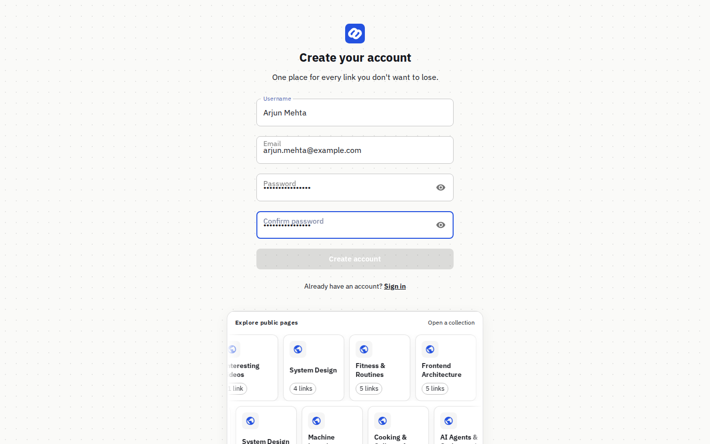

### Sign in — and explore what's already public

The sign-in screen previews real, currently-published pages from the database, so
a visitor can see what the app is for before creating an account.

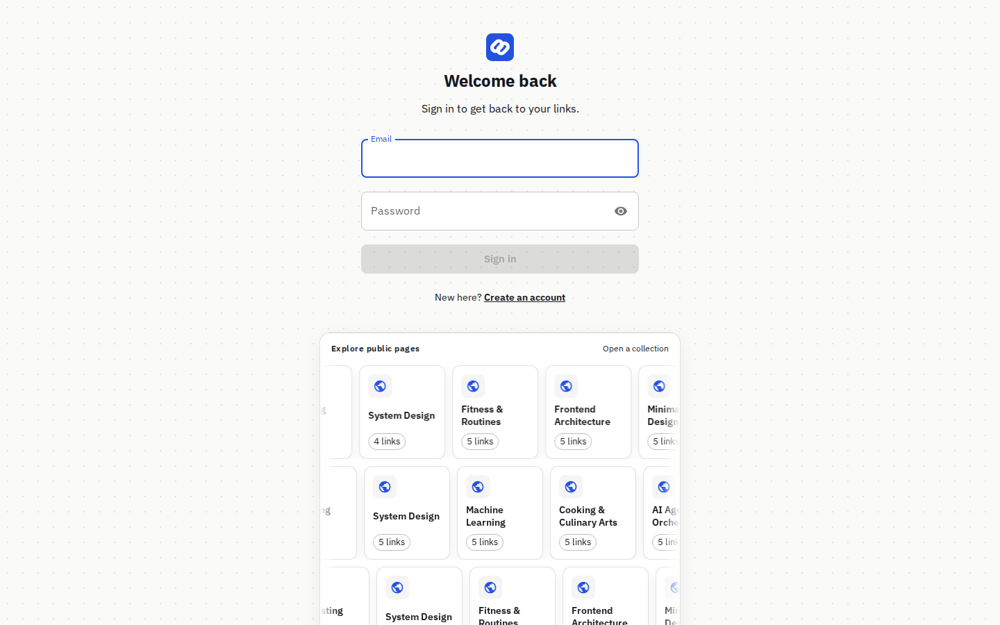

### Your workspace

A fresh account starts with an empty sidebar and a clear nudge toward creating the
first page.

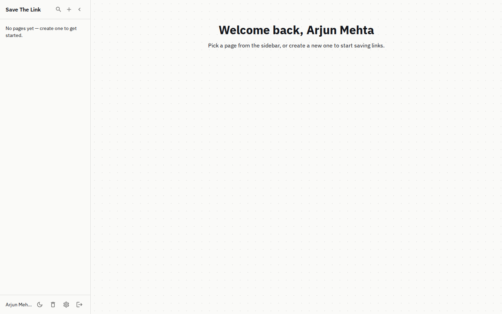

### Pages, link cards & tags

Paste a link and its title, description, favicon and cover image are fetched
automatically. Add your own tags and they become one-click filters at the top of
the page.

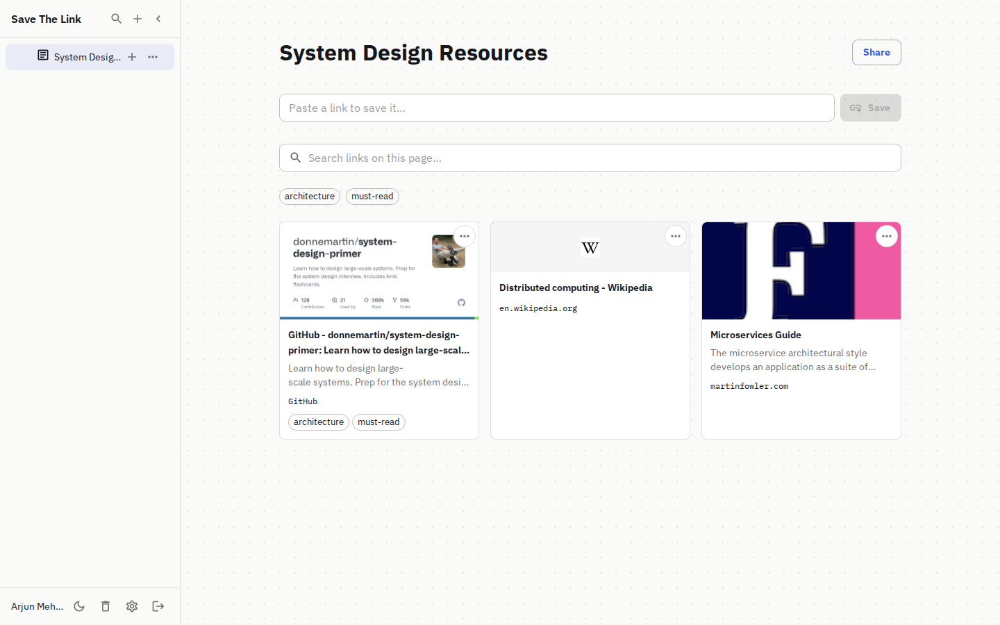

### Search — on a page, and everywhere

Every page has its own search bar for narrowing down its links:

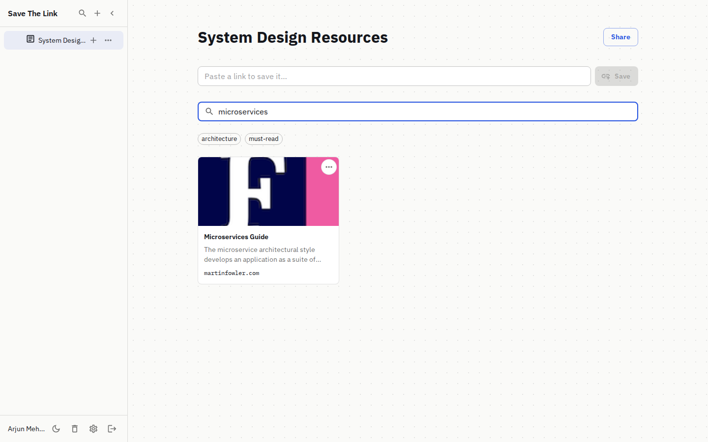

...and `Ctrl/Cmd+K` opens a global search across every page and link you own:

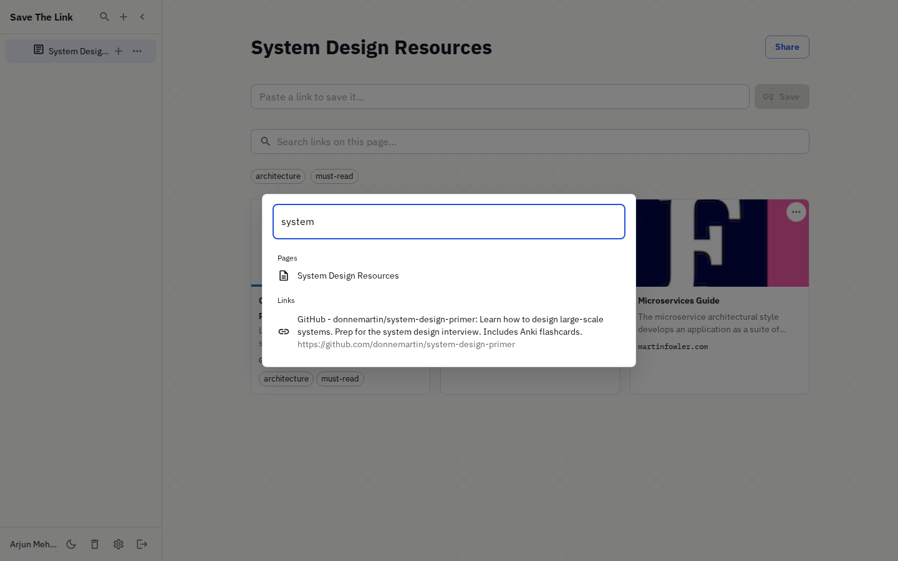

### Sharing & collaboration

Publish a page as view-only, editable by anyone with the link, or — like Google
Drive — editable only by people you specifically add. Adding someone looks up
registered users by email as you type.

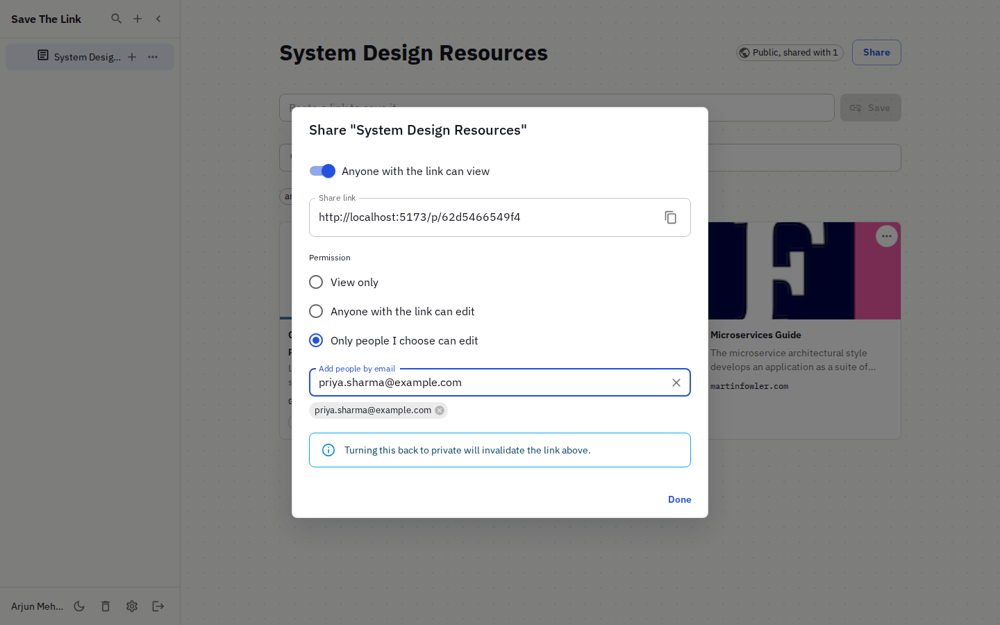

### Dark mode

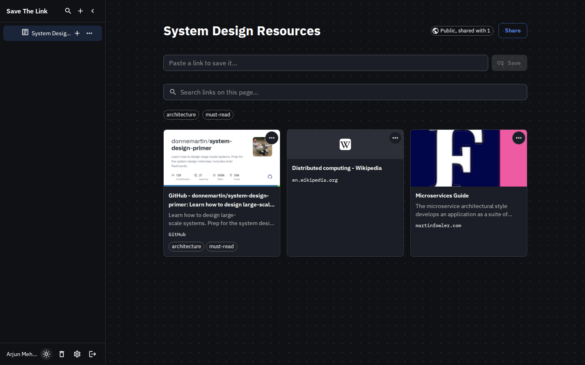

### Trash & restore

Deleted pages sit in the trash until you restore them or remove them for good.

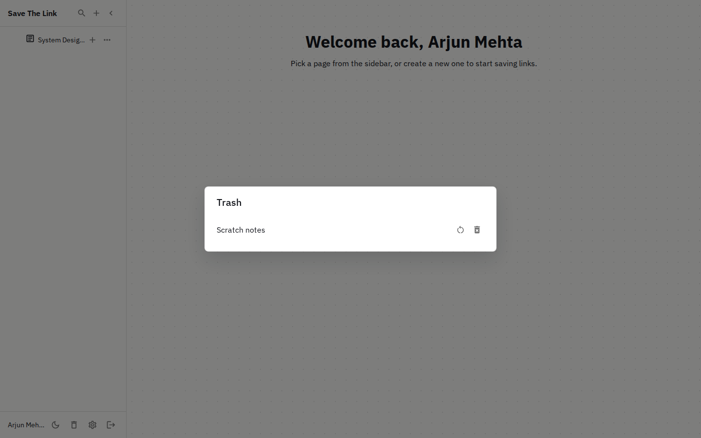

### Settings

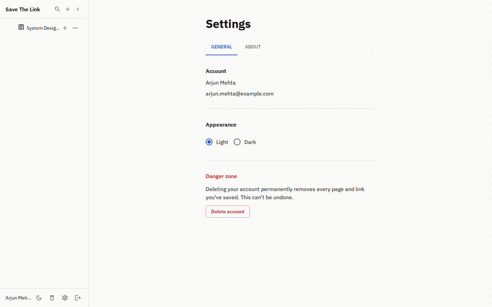
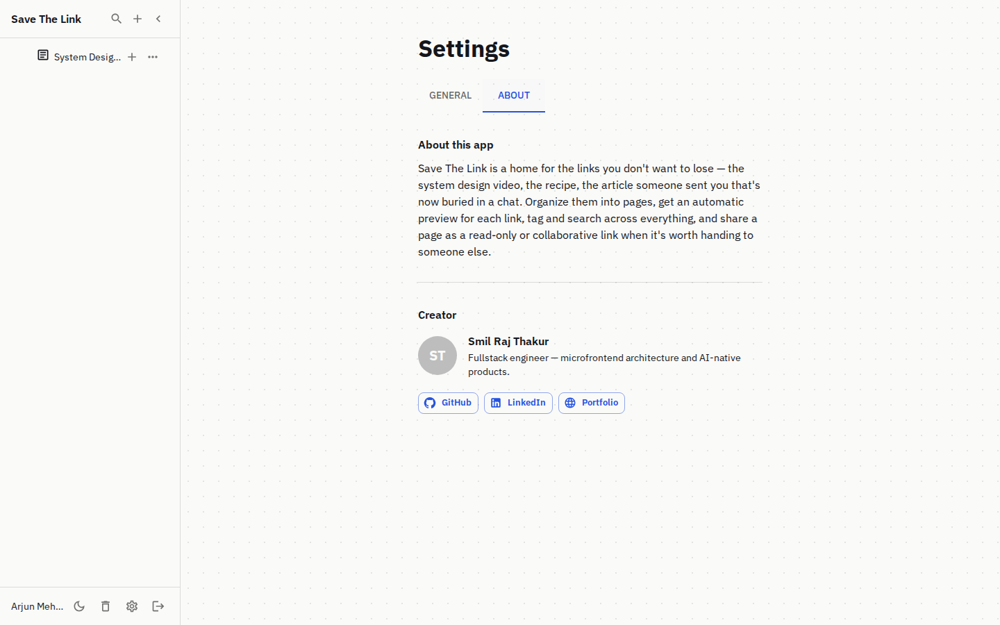

### Responsive on mobile

The sidebar becomes an overlay drawer and the page header reflows to two rows so
nothing gets clipped on a small screen.

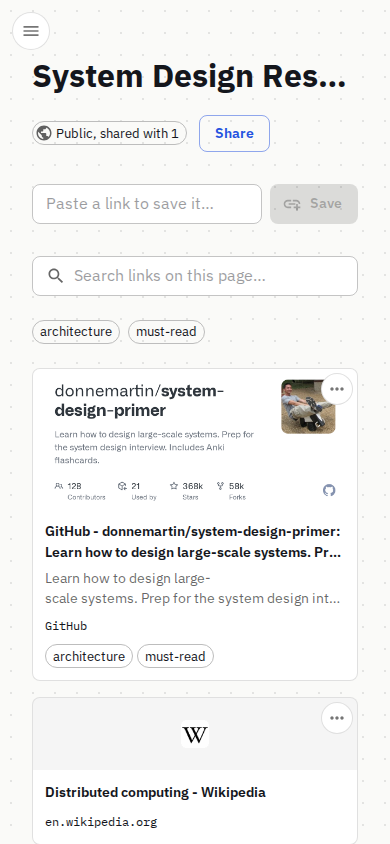

### Public pages, for guests too

Anyone with a share link can view a public page without an account — and if they're
not signed in, a banner invites them to create one.

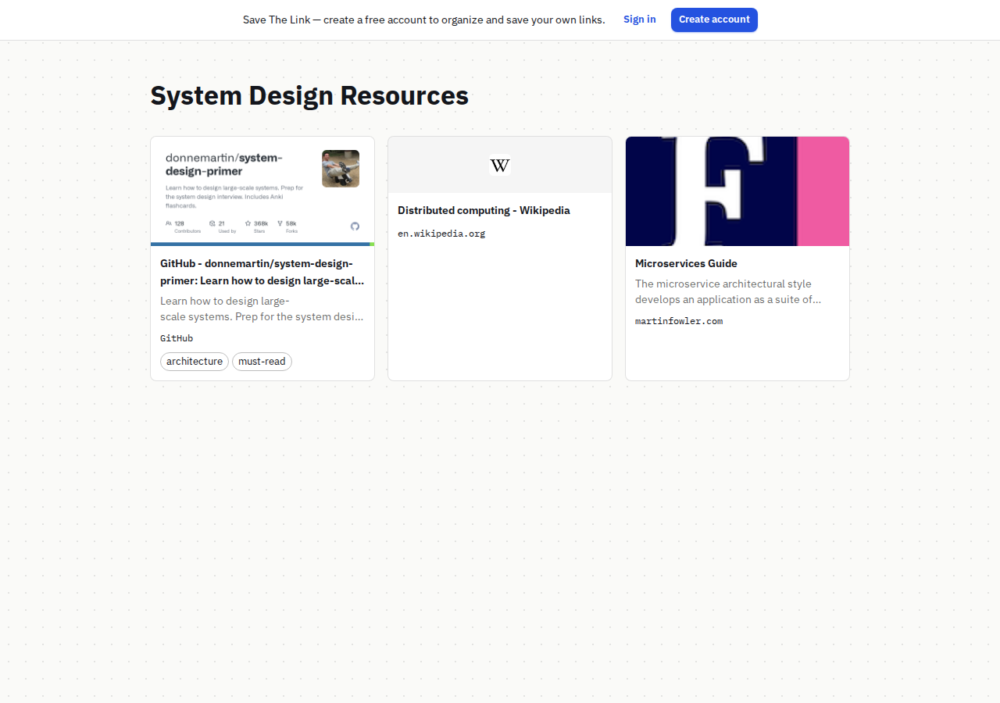

### Bookmarks & getting back to your own pages

A public page has no sidebar of its own, so a logged-in visitor gets a bar back to
their own workspace — and, on a page they don't own, a one-click bookmark:

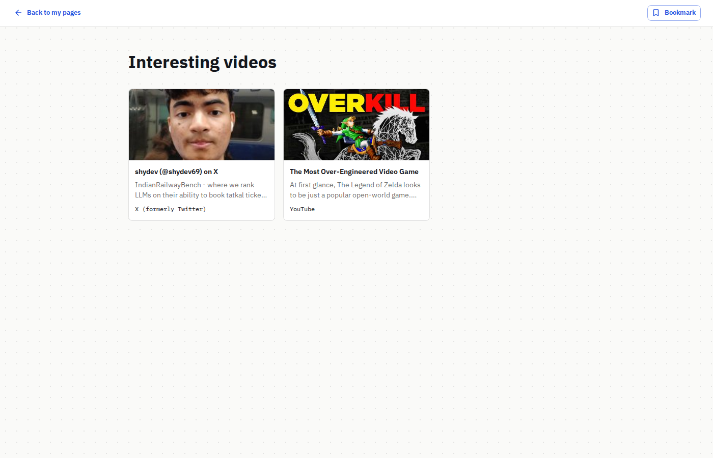

Bookmarked pages show up in their own section in the sidebar for quick access
later, with no need to re-find the original share link:

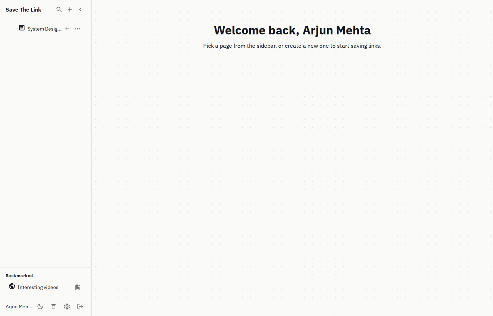

## Tech stack

- **Backend** — Go, Gin, MongoDB (official Go driver v2), JWT auth via httpOnly cookies
- **Frontend** — React, Vite, TypeScript, Material UI, TanStack Query, React Hook Form + Zod

## Running locally

### Prerequisites

- Node.js (v20+)
- Go (1.20+)
- A MongoDB connection string (local or Atlas)

### Backend

```bash
cd ../save-the-link.backend
# copy .env.sample to .env and fill in your MongoDB credentials
go run ./cmd/api/main.go
```

### Frontend

```bash
npm install
npm run dev
```

Then open `http://localhost:5173`.
